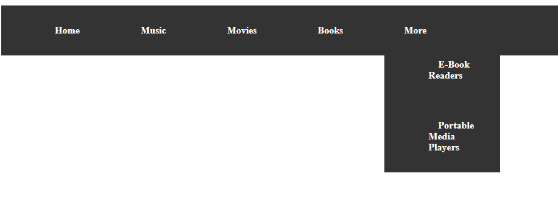

# Instructions  

Let's play around with Pseudo-classes and selectors.

## Part 1
 Your job is to take the included code and arrange the link list horizontally, using just CSS. You may also, if you like, use the `:hover` pseudo-class to highlight the menu item over which the mouse cursor moves (set the background color, perhaps)

 ## Part 2

 This part's a little trickier. Add this bit of code to `index.html`:

 ```
 ...
 <li><a href="#">Books</a></li>
 <li><a>More</a>
    <ul>
         <li><a href="#">E-Book Readers</a></li>
         <li><a href="#">Portable Media Players</a></li>
    </ul>
</li>
...
```

The end result *might* look like this, but you are free to style it however you wish:



Notice how this creates a sub-list inside your main navigation menu. Your task will be to keep the sub-menu hidden until the visitor hovers the mouse-pointer over the "More" menu item. Then the sub-menu will show up.

Here are the keywords from this chapter:

* CSS Box Model
* content
* padding
* border
* margin
* DevTools
* element display
* element flow
* position
* visibility
* floated elements
* `float`
* `clear`
* attribute selector
* pseudo-class
* pseudo-element
* child selector
